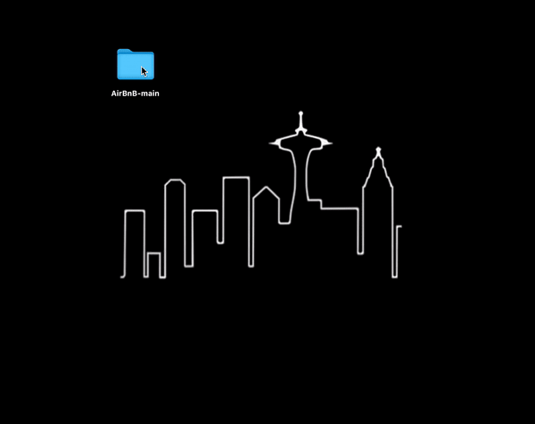
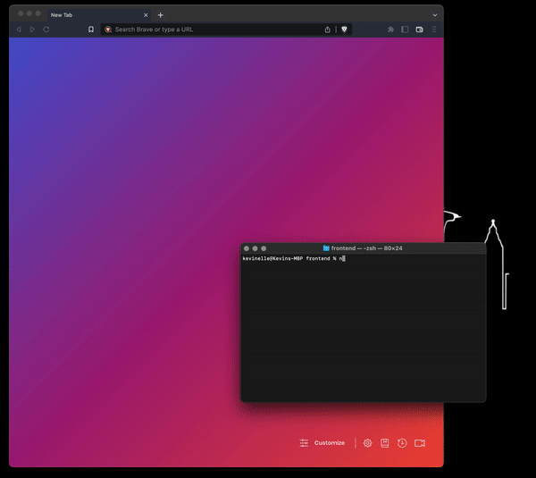
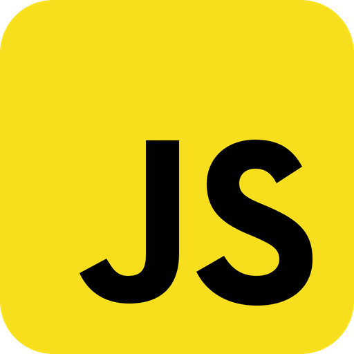
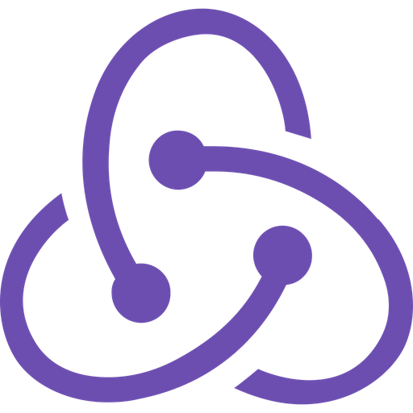

---

## Contents

- [Overview](https://github.com/kevinlongboy/Learnwell/blob/main/README.md#-overview)
- [Features](https://github.com/kevinlongboy/Learnwell/blob/main/README.md#-features)
- [Download](https://github.com/kevinlongboy/Learnwell/blob/main/README.md#-download)
- [Tech Stack](https://github.com/kevinlongboy/AirBnB/blob/main/README.md#-tech-stack)
- [Contact](https://github.com/kevinlongboy/AirBnB/blob/main/README.md#-contact)

---

## Overview

Welcome to Learnwell! A simple web application that allows users to create, comment on, and watch educational videos.

### Style Guide
Visit the <a href="https://www.figma.com/design/wdkjKJt0j9wxk7cAeLOXTQ/Learnwell?node-id=78-1563" alt="Figma page">Figma page</a> for a look at the API's wire frames and style guide.

### API Documentation
Visit the <a href="https://github.com/kevinlongboy/Learnwell/wiki" alt="Wiki website">Wiki page</a> for documentation on the API's database schema and backend routes.
 
 

---

## Features

### Discussions

_Learn Something New_

Acquire knowledge and new skills by learning from your peers. 

As a member of the site, each user is able to watch discussion videos created by other members: 

... Or start their own discussion by uploading their own video:

Users can also edit and delete previously uploaded videos:

 
 

### Comments

_Get Into Heated Debates_

Continue your growth by getting feedback from your peers.

Users are able to leave comments on any videos posted on the site and read ones left by other users:

 
 

---

## Download

Ready to run the app? Follow the instructions below:

### 1. Navigate to GitHub:
* Click <a href="https://github.com/kevinlongboy/Learnwell" alt="CraneBnB GitHub repository link">here</a> to be redirected to the CraneBnB page

### 2. Download the API: 
* Click the "Code" button
* Select "Download ZIP" from the dropdown menu
* Save the file in your desired location

### 3. Open the repository:
* Navigate to the location where you previously saved your zipped file
* Unzip the file by double-clicking on the icon, or by right-clicking on the icon and selecting "Open"
* This unzipped folder is the repository which contains both the backend and frontend components of the API

### 4. Initialize the backend: 
* Open a new terminal
* Navigate to the _backend_ folder
* Download dependencies by running the command: "npm install"
* Initialize your database by running "npx dotenv sequelize db:migrate"
* Populate your database by running "npx dotenv sequelize db:seed:all"
* Start the backend server by running the command: "npm start"

### 5. Initialize the frontend: 
* Open a new terminal
* Navigate to the _frontend_ folder
* Download dependencies by running the command: "npm install"
* Start the frontend server by running the command: "npm start"

### 6. Launch the app:
* Allow React to open the app in your browser
* Welcome to CraneBnB

---

## Languages and Libraries Used

### Framework:

 

### Frontend:

 

 
 

### Backend:

   
 
  
---
  
## Contact

 
 